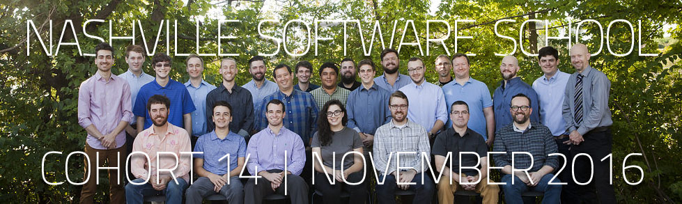

# [nss-day-cohort-14.github.io](https://nss-day-cohort-14.github.io/) Click to visit

## [NSS](http://nashvillesoftwareschool.com/) Cohort D14  
#### Instructors -  
[Joe Shephard](https://github.com/JoeShep) (Front-End)  
[Scott Humphries](https://github.com/sscotth) (Back-End)  

#### Advisors -  
[Caitlin Stein](https://github.com/C-Stein)  
[Callan Morrison](https://github.com/morecallan)  
[Christina Young](https://github.com/ChristinaJYoung)  
[Mathew Ostrander](https://github.com/MAOstrander)  

#### Cohort 14 Website Contributors -  
[Alex Horton](https://github.com/alexhortonmusic) (Project Lead)  
[Tim Creasy](https://github.com/timcreasy)  
[Tyler Daniel](https://github.com/iamtylerd)  
[Eric Denton](https://github.com/iamericanartist)  
[John D. Hamm](https://github.com/JohnDHamm)  
[Matt Latham](https://github.com/lathammatt)  
[Dominic Serrano](https://github.com/DominicSerranoC14)  
[Lauren Cherie Smith](https://github.com/laurensaurenson) (Design Lead)  

***

  
  
  
  

***

### What We Learned
The Web Developer Bootcamp is a six-month, full-time program. The curriculum teaches the skills and technologies required to become a full-stack software developer. For many of us, this course was our first introduction to programming. The core technologies that we used in this course are the three standard languages of the web: HTML, CSS and JavaScript. This course prepared us to work and build the front-end code associated with websites, web apps and hybrid mobile applications.

We also learned the key features and capabilities of Javascript and the MEAN stack with a server-side software development technology stack. This included advanced JavaScript concepts, Node.js - a server platform supporting the deployment of server-side code built in JavaScript, ExpressJS - a lightweight and flexible Node.js web application framework, and a wide range of supporting and related technologies. We were also introduced to SQL and NoSQL database management, test-driven development, agile methods, and other key concepts and tools designed to help accelerate our entry into a career in software development.

- Program with Javascript and the Node.js framework
- HTML, CSS and Javascript
- Web application development and design
- Application deployment and management
- Skills necessary to join a development team as a junior developer

Sincerely,

### [Cohort 14](https://github.com/orgs/nss-day-cohort-14/people)  

  

